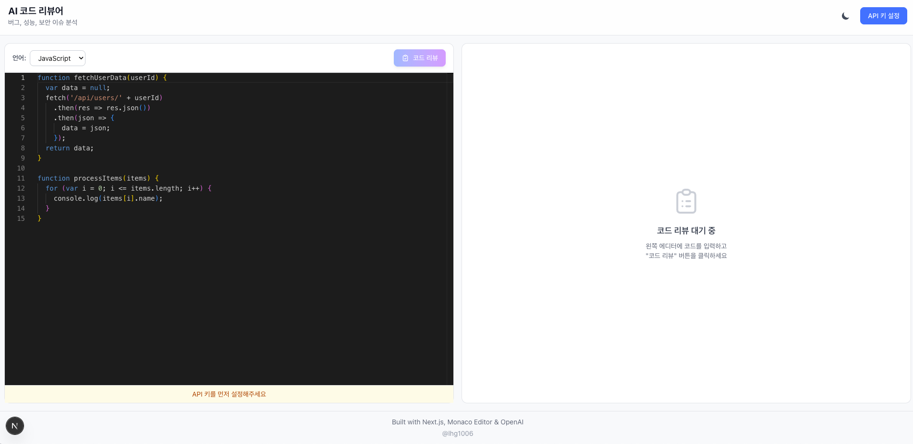
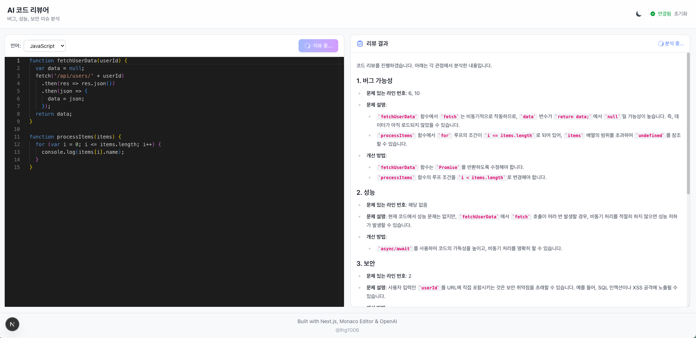

# AI Code Reviewer

AI 기반 코드 리뷰 도구 - 코드를 분석하고 개선점을 제안합니다.




## 주요 기능

- **코드 에디터**: Monaco Editor 기반 구문 강조 코드 편집기
- **AI 코드 리뷰**: OpenAI GPT를 활용한 코드 분석 및 피드백
- **마크다운 렌더링**: 리뷰 결과를 마크다운 형식으로 보기 좋게 표시
- **다크/라이트 모드**: 테마 전환 지원

## 기술 스택

| 분류 | 기술 |
|------|------|
| Frontend | Next.js 16, React 19, TypeScript |
| Editor | Monaco Editor (@monaco-editor/react) |
| AI | OpenAI GPT API |
| Styling | Tailwind CSS |
| Markdown | react-markdown |

## 시작하기

### 1. 설치

```bash
npm install
```

### 2. 환경 변수 설정

```bash
# .env.local
OPENAI_API_KEY=your-openai-api-key
```

### 3. 실행

```bash
npm run dev
```

http://localhost:3000 에서 확인

## 사용 방법

1. 좌측 코드 에디터에 리뷰받을 코드 입력
2. "리뷰 요청" 버튼 클릭
3. 우측 패널에서 AI 코드 리뷰 결과 확인

## 리뷰 항목

- 코드 품질 및 가독성
- 잠재적 버그 및 에러
- 성능 개선 제안
- 보안 취약점
- 베스트 프랙티스 권장사항

## 프로젝트 구조

```
src/
├── app/
│   ├── api/          # API Routes (OpenAI 연동)
│   └── page.tsx      # 메인 페이지
├── components/       # React 컴포넌트
└── lib/              # 유틸리티 함수
```

## 라이선스

MIT License
